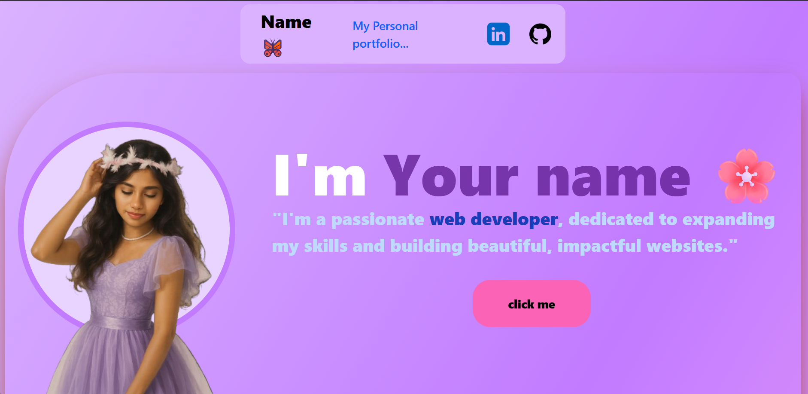
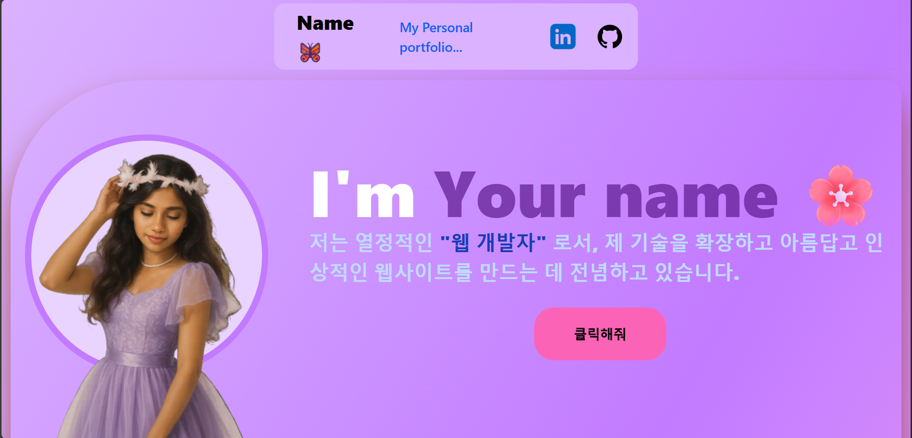
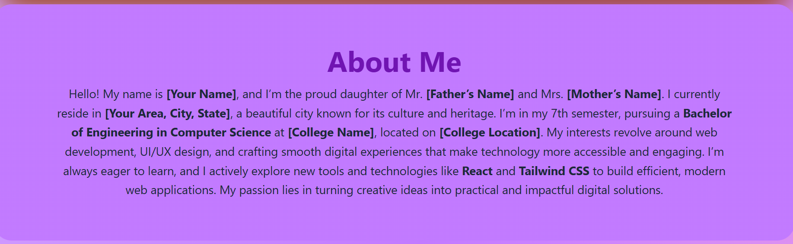
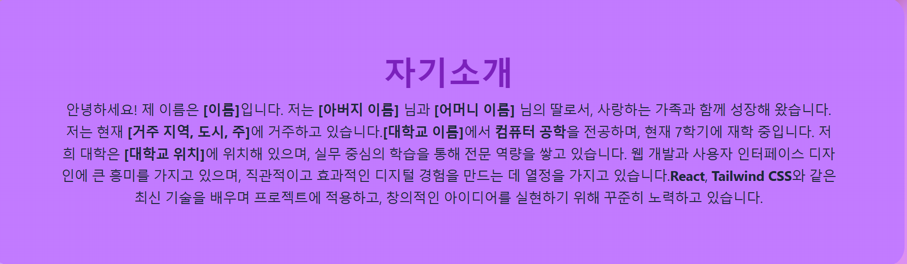
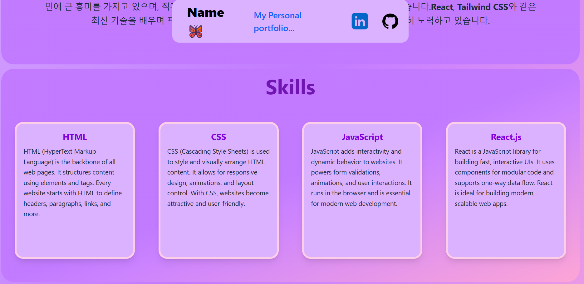
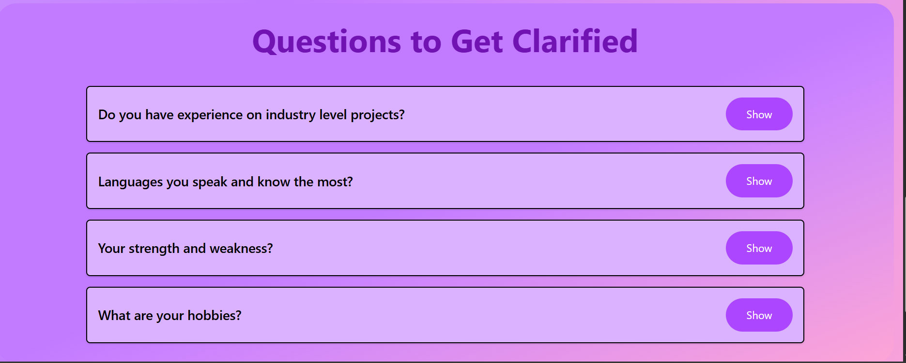
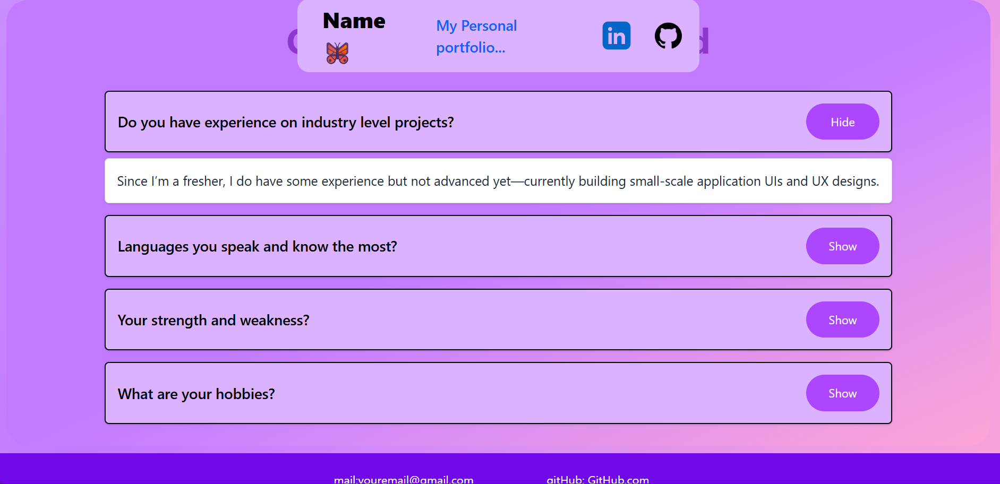
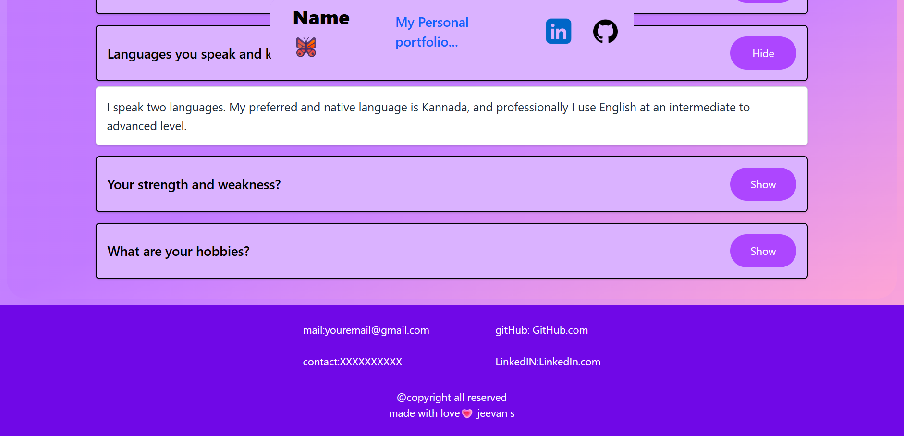

# Portfolio Web Application

A **simple and modern portfolio** web application built with **React** and **Tailwind CSS**.  
This is a **single-page application (SPA)** that showcases navigation, skills, about section, Q&A section, and a one-click English-to-Korean translation feature.

---

## 🛠 Features

- **Responsive navigation bar** and footer
- **About Section** with a brief introduction
- **Skills Section** showcasing technologies and expertise
- **Q&A Section** using an accordion for frequently asked questions
- **One-click English-to-Korean translation** for content
- **Built with React and Tailwind CSS**

---

## 🖼 Screenshots / Preview

Here are placeholders for images/screenshots of the application:

1.   
2.   
3.   
4.   
5.   
6.   
7.   
8.   
9.   

> Replace these placeholders with actual images of your web page.

